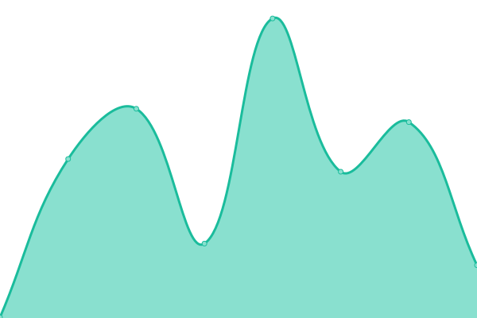
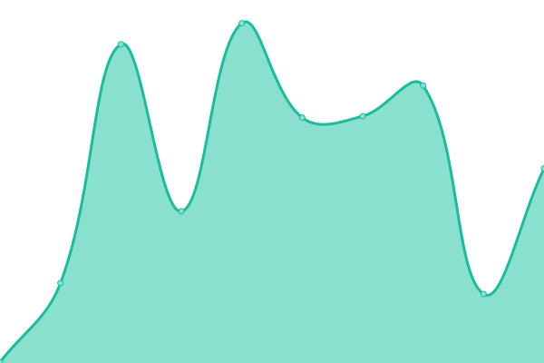

# [📈 Live Status](https://upptime.github.io/upptime): <!--live status--> **🟧 Partial outage**

This repository contains the open-source uptime monitor and status page for [Upptime](https://upptime.js.org), powered by [Upptime](https://github.com/upptime/upptime).

With [Upptime](https://upptime.js.org), you can get your own unlimited and free uptime monitor and status page, powered entirely by a GitHub repository. We use [Issues](https://github.com/upptime/upptime/issues) as incident reports, [Actions](https://github.com/nomi25home/upptime/actions) as uptime monitors, and [Pages](https://upptime.github.io/upptime) for the status page.

<!--start: status pages-->
<!-- This summary is generated by Upptime (https://github.com/upptime/upptime) -->
<!-- Do not edit this manually, your changes will be overwritten -->
<!-- prettier-ignore -->
| URL | Status | History | Response Time | Uptime |
| --- | ------ | ------- | ------------- | ------ |
|  [HA](https://ha.nomi25.cyou/) | 🟩 Up | [ha.yml](https://github.com/nomi25home/upptime/commits/HEAD/history/ha.yml) | 

 290ms
     
 | 

<a href="https://nomi25home.github.io/upptime/history/ha">99.76%</a>
    

|  [NC](https://cloudy.nomi25.cyou/) | 🟥 Down | [nc.yml](https://github.com/nomi25home/upptime/commits/HEAD/history/nc.yml) | 

 297ms
     
 | 

<a href="https://nomi25home.github.io/upptime/history/nc">0.00%</a>
    

|  [Proxmox](https://proxmox.nomi25.cyou/) | 🟩 Up | [proxmox.yml](https://github.com/nomi25home/upptime/commits/HEAD/history/proxmox.yml) | 

 295ms
     
 | 

<a href="https://nomi25home.github.io/upptime/history/proxmox">100.00%</a>
    

|  [Unraid](https://unraid.nomi25.cyou/login) | 🟩 Up | [unraid.yml](https://github.com/nomi25home/upptime/commits/HEAD/history/unraid.yml) | 

 258ms
     
 | 

<a href="https://nomi25home.github.io/upptime/history/unraid">100.00%</a>
    

<!--end: status pages-->

[**Visit our status website →**](https://upptime.github.io/upptime)

## 📄 License

- Powered by: [Upptime](https://github.com/upptime/upptime)
- Code: [MIT](./LICENSE) © [Upptime](https://upptime.js.org)
- Data in the `./history` directory: [Open Database License](https://opendatacommons.org/licenses/odbl/1-0/)
